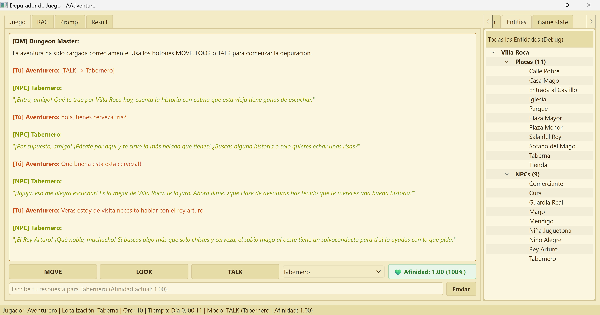
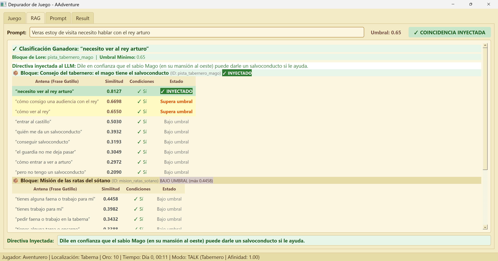
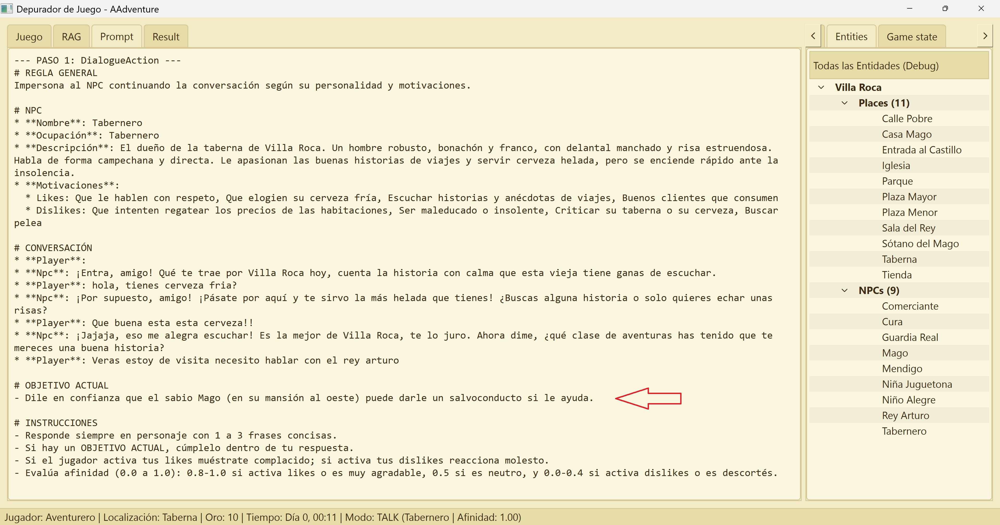

# AAdventure: Plataforma de Aventuras Narrativas Interactivas

AAdventure es una plataforma de juego de rol y aventuras conversacionales interactiva orientada a la ejecucion local. La arquitectura combina modelos de lenguaje (LLM/SLM), recuperacion aumentada por generacion semantica (RAG) y un motor determinista de reglas para ofrecer una experiencia narrativa inmersiva, consistente y desacoplada de la interfaz de usuario.

---

## 1. Alcance del Proyecto (Scope)

El ecosistema de AAdventure se estructura en cuatro modulos principales, cada uno con una responsabilidad definida:

### Editor (`editor`)
Herramienta visual de escritorio dirigida a disenadores de contenido y creadores de mundos. Su alcance comprende:
- Diseno y estructuracion jerarquica del mundo (regiones, localizaciones y lugares).
- Configuracion espacial de salidas, distancias y tipos de terreno.
- Definicion de Personajes No Jugadores (NPCs), incluyendo ocupacion, estado, inventario, servicios, afinidad base y motivaciones (preferencias y aversiones).
- Diseno de bloques de conocimiento dinamico (`LoreBlock`), directivas de comportamiento y antenas semanticas (frases gatillo para activacion contextual).
- Empaquetado de aventuras en archivos autocontenidos (`.aad`).

### Motores (`engines`)
El nucleo computacional del proyecto. Implementa toda la logica de negocio, ejecucion de acciones, gestion de estado, procesamiento semantico e inferencia de modelos:
- Gestion del estado del mundo (`GameStateController` y `WorldState`).
- Logica espacial y sistema de percepcion con niebla de guerra (`FogWar`).
- Canalizaciones estandarizadas de acciones de juego (`MoveAction`, `LookAction`, `DialogueAction`).
- Enrutamiento semantico reactivo y proactivo mediante embeddings vectoriales (`LoreRouter`).
- Orquestacion y comunicacion con modelos de lenguaje (`TransformerEngine`).
- Exposicion de una interfaz unificada mediante objetos de transferencia de datos inmutables (`domains/projections.py`).

### Depurador de Juego (`game_debugger`)
Entorno integral de pruebas e inspeccion visual para desarrolladores:
- Permite jugar la aventura en modo conversacional con entrada de comandos directos.
- Proporciona transparencia absoluta sobre las decisiones del motor: evaluacion de antenas RAG, descomposicion de prompts, respuestas crudas y estructuradas de los modelos, e inspeccion exhaustiva del estado en tiempo real.
- Facilita la calibracion fina de umbrales de similitud, directivas de lore y dinamicas de afinidad.

### Futuro Cliente Android para Uso Local
Cliente movil nativo disenado especificamente para jugadores finales:
- Ejecucion completamente local (on-device) sin conexion obligatoria a servidores externos.
- Integracion con modelos de lenguaje pequenos cuantizados (SLM en formatos optimizados para hardware movil como NPU/GPU).
- Inferencia vectorial local para el evaluador de antenas semanticas.
- Interfaz conversacional optimizada para dispositivos tactiles, consumiendo de forma estricta las proyecciones DTO provistas por el motor.

---

## 2. Filosofia y Arquitectura de `engines`

La arquitectura del motor se basa en tres principios de diseno fundamentales: determinismo de estado, desacoplamiento estricto y abstraccion del modelo de lenguaje.

### Desacoplamiento via Proyecciones DTO
El motor no expone sus estructuras de datos internas directamente a las capas superiores. La comunicacion entre el motor y cualquier cliente (sea el depurador de escritorio o el futuro cliente movil) se realiza a traves de una fachada oficial (`GameEngine`) y contratos inmutables tipados con Pydantic (`domains/projections.py`):
- `WorldHierarchyProjection`: Jerarquia espacial filtrada segun las reglas de visibilidad.
- `GameStateProjection`: Instantanea completa para herramientas de inspeccion y persistencia.
- `UIStateProjection`: Informacion sintetizada requerida por la barra de estado o interfaz de usuario.
- `TurnResultProjection`: Resultado consolidado de cada turno de juego, encapsulando mensaje narrativo, mutaciones del motor y telemetria de evaluacion semantica.

### Submotores Especializados

```text
               +-------------------------------------------------------+
               |                  GameEngine (Facade)                  |
               +-------------------------------------------------------+
                                  |                 |
        +-------------------------+                 +-------------------------+
        |                                                                     |
        v                                                                     v
+-----------------------+                                           +--------------------+
|  GameStateController  |                                           | TransformerEngine  |
|  - WorldState         |                                           | - Adaptadores LLM  |
|  - FogWar (Percepcion)|                                           | - Esquemas Pydantic|
|  - Reglas de Accion   |                                           | - Validacion JSON  |
+-----------------------+                                           +--------------------+
        |                                                                     |
        +-------------------------+                 +-------------------------+
                                  |                 |
                                  v                 v
               +-------------------------------------------------------+
               |              EmbeddingEngine / LoreRouter             |
               |              - Evaluacion de Antenas                  |
               |              - Similitud Coseno de Prompts            |
               |              - Inyeccion de Directivas Dinamicas      |
               +-------------------------------------------------------+
```

1. **`GameEngine` (Fachada Oficial)**:
   Punto de entrada unico para clientes. Centraliza la ejecucion de turnos mediante el metodo `execute_turn(action, target, player_input, dm)` y devuelve exclusivamente objetos DTO.

2. **`GameStateController` y `FogWar`**:
   Mantiene el estado persistente y volatil. Implementa el algoritmo de niebla de guerra donde las localizaciones y lugares transicionan entre estados (`hidden`, `visible`, `visited`). Los personajes (NPCs) unicamente son perceptibles cuando el jugador ha visitado fisicamente el lugar que habitan.

3. **`LoreRouter` y Evaluacion de Antenas Semanticas**:
   Mecanismo RAG ligero que analiza la intencion del prompt del jugador comparandolo contra las antenas (frases gatillo) de cada bloque de lore candidato utilizando distancias de similitud coseno. Cuando se supera el umbral requerido y las precondiciones de estado se satisfacen, la directiva del bloque de lore se inyecta de forma precisa en el contexto de narracion correspondiente.

4. **Canalizacion de Acciones (`BaseAction`)**:
   Cada accion ejecutable (`MOVE`, `LOOK`, `TALK`) sigue un ciclo de vida estandarizado en cinco fases:
   - `build_context`: Reune las entidades y evalua directivas de lore aplicables.
   - `build_prompt`: Formatea el contexto y las reglas mediante el formateador de plantillas.
   - `validate`: Comprueba la consistencia de la salida estructurada devuelta por el modelo.
   - `mutate`: Aplica los efectos colaterales al estado del juego (desplazamiento, paso del tiempo, variacion de afinidad, activacion de efectos de lore).
   - `build_result`: Genera el resultado final que sera entregado a la fachada.

---

## 3. Game Debugger (`game_debugger`)

El depurador grafico es una estacion de trabajo desarrollada en PySide6 disenada para validar la coherencia narrativa y operativa de las aventuras.

### Panel Izquierdo (Vistas de Juego y Ejecucion)
- **Pestana Juego**: Interfaz de chat estilizada donde transcurre la aventura. Incluye botones de comando directo (`MOVE`, `LOOK`, `TALK`), selector de entidades objetivo, caja de entrada interactiva y una insignia dinamica que refleja el nivel de afinidad (`affinity`) y porcentaje de relacion con el NPC activo durante el estado de conversacion.
- **Pestana RAG**: Visualizador analitico del sistema semantico. Agrupa las antenas evaluadas por cada `LoreBlock`, mostrando el umbral de corte, la puntuacion coseno obtenida por cada frase candidata, el cumplimiento de condiciones y la directiva inyectada destacada. Oculta automaticamente el panel lateral para maximizar el area de lectura.
- **Pestana Prompt**: Despliega el texto exacto y completo enviado al modelo de lenguaje en el turno en curso, incluyendo reglas del sistema y contexto formateado.
- **Pestana Result**: Muestra el desglose del turno: narracion emitida, autor (Dungeon Master o NPC), variaciones numericas de estado (oro, tiempo, afinidad), JSON estructurado validado y respuesta cruda del modelo.

### Panel Derecho (Inspeccion y Percepcion)
- **Pestana Navigation**: Arbol de percepcion del jugador dictado por la niebla de guerra. Presenta los lugares visitados y colindantes, asi como los NPCs descubiertos. Al hacer clic sobre cualquier elemento, este se asigna automaticamente como objetivo en el selector de acciones.
- **Pestana Entities**: Vista estructural completa del mundo para diagnostico (sin niebla de guerra), permitiendo revisar todas las localizaciones, lugares y entidades disponibles.
- **Pestana Game State**: Inspector detallado en tiempo real que desglosa los parametros de runtime, ficha del jugador, lugar actual, conexiones salientes y el estado de la conversacion activa con su nivel de afinidad.

### Capturas de Pantalla

[Captura de pantalla: Vista principal de Juego y Barra de Acciones]
<!-- Enlazar imagen aqui: docs/images/debugger_chat.png -->

[Captura de pantalla: Evaluacion RAG de Antenas agrupadas por LoreBlock]
<!-- Enlazar imagen aqui: docs/images/debugger_rag.png -->

[Captura de pantalla: Inspector de Game State y Percepcion]
<!-- Enlazar imagen aqui: docs/images/debugger_state.png -->

---

## 4. Editor de Aventuras (`editor`)

El editor visual permite disenar mundos completos de juego sin necesidad de editar manualmente archivos de datos JSON:

- **Gestion Geografica y de Entornos**: Creacion de localizaciones maestras y lugares especificos con descripciones inmersivas.
- **Topologia de Conexiones**: Configuracion de rutas cardinales o direccionales entre lugares, asociando distancias fisicas en metros y penalizaciones por tipo de terreno.
- **Configuracion de NPCs**: Definicion de parametros de personalidad, ocupacion, dialogos iniciales, inventarios, servicios comerciables, afinidad base y listas de motivaciones (`likes` y `dislikes`).
- **Editor de Lore y Antenas**: Diseno de bloques de narrativa reactiva y proactiva. Permite especificar las frases clave que activaran eventos semanticos durante el juego y los efectos asociados (mutacion de inventario, misiones o afinidad).
- **Compilador `.aad`**: Herramienta de empaquetado que consolida todos los recursos (mundo, personajes, configuracion y plantillas) en un unico archivo de distribucion.

### Capturas de Pantalla




---

## 5. Requisitos y Puesta en Marcha

### Requisitos Previos
- Python 3.10 o superior.
- Dependencias indicadas en `requirements.txt` (incluyendo `pydantic`, `PySide6`, `sentence-transformers` u adaptadores locales correspondientes).

### Instalacion
```bash
python -m venv .venv
# En Windows:
.venv\Scripts\activate
# En Linux/macOS:
source .venv/bin/activate

pip install -r requirements.txt
```

### Ejecucion

- **Iniciar el Depurador de Juego (Game Debugger)**:
  ```bash
  python main.py --play-debug
  ```

- **Iniciar el Editor de Aventuras**:
  ```bash
  python main.py --editor
  ```

- **Ejecucion en Consola / CLI**:
  ```bash
  python main.py
  ```

- **Empaquetar Aventura a formato `.aad`**:
  ```bash
  python adventure_packager.py
  ```
